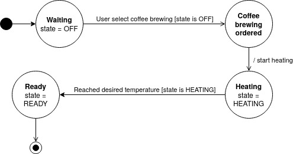

**Exercise: Python-Based Embedded BDD Testing with Pytest**
To run the sample: docker-compose up --build

**Scenario:**
You are working on an embedded system that controls a temperature control unit for a coffee maker. Your task is to implement BDD tests for a basic feature of this system: heating up the water when the user selects a coffee brewing option.

**Requirements:**

1. The temperature control unit should have three states: OFF, HEATING, and READY.
2. By default, it should be in the OFF state.
3. When the user selects a coffee brewing option, it should transition from OFF to HEATING and then to READY when the desired temperature is reached.

**Instructions:**

1. Set up a new Python project for this exercise. You can use Pytest for writing BDD-style tests. We have provided you with a dummy framework implementation.

2. Create a Python module for the temperature control unit with functions to control its state (e.g., `set_temperature_state(state)`). We have provided you with a dummy product implementation - or keep the mocked implemation as is if you can't. Make sure you understand the project and familiarize yourself with basic python package creation, docker, pytest and bdd.

3. Write a state diagram for the coffee maker and describe the boundary conditions for the transitions
   
    > I hope the syntax suits you, I know thare are multiple standards. I used the one I learned (i.e. transitions: Event \[Condition\] / action). 

4. Have a look at the `TemperatureControlUnit` class in your Python module. Notice how it's just a sample implementation and isn't doing anything. Get creative and provide some options for a developer to implement an actual coffee maker as well as how you would test this. No code stubs needed for this part of the excercise
    
    > For instance, there is no interaction with a temperature sensor. We could create a `TemperatureSensorObserver` class, as well as a `HeatingElementControlUnit`. Then, when the user order a new coffee in `start_heating()`, we call a function of the `TemperatureSensorObserver` singleton instance, which will call back the `reach_desired_temperature()` of the current `TemperatureControlUnit` instance when the water reaches the desired temperature, and we also start the heating through the `HeatingElementControlUnit`.\
    To test them, we could create a similar classes which simulate a sensor and heating element, with a timer for example. We could increase the temperature by one unit every second. And thus in the test, instead of calling ourselves `reach_desired_temperature()` in the step "the water reached the desired temperature", we pause the thread for a little more than the desired temperature in seconds. In the meantime, the sensor will normally have changed the state of the machine.\
    \
    Also, the desired temperature is not materialized as a parameter, we could specify it in the `TemperatureControlUnit` constructor, and pass it to the sensor observer when we call it.\
    \
    Like that, in addition to the liveness conditions, we could also test safety conditions thanks to the sensor, in a scenario that ensure that the water does not exceed the desired temperature, in that case, we could call an emergency stop.
    \
    And at the same time, we could offer to the user the possibility to stop at anytime its coffee brewing.

5. Write a runner script or use Pytest's built-in test runner to execute the tests. Ensure that the tests pass successfully for the specified scenarios. The test cases should cover different aspects of the behavior, including the initial state, user input events, and expected state transitions. A rough harness has been provided in tests/test_temperature_control.py

6. Now that we wrote some tests - great! Verify they pass

7. What do you think about the scenario? The spec has a flaw in it, can you make a suggestion?

    > The machine will be stuck in `Ready` state after the first coffee. We could add a transition from `Ready` to `Coffee brewing ordered` to fix this flaw.